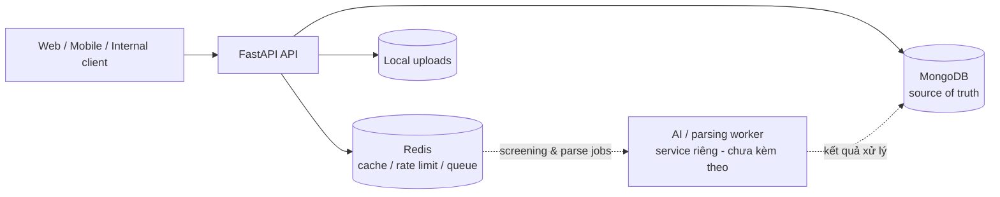

# Resume Screening System

Backend quản lý quy trình tuyển dụng và sàng lọc hồ sơ, xây dựng bằng FastAPI, MongoDB, Redis và Beanie ODM.

Phiên bản hiện tại tập trung vào khung backend: quản lý tenant, ứng viên, hồ sơ, đơn ứng tuyển, scorecard, vòng đời screening, phân quyền, audit log và hàng đợi xử lý. AI inference được thiết kế để tách thành service/worker riêng và chưa nằm trong Docker stack này.

## Trạng thái hệ thống

Docker Compose hiện khởi chạy đúng ba service:

| Service | Container | Truy cập | Vai trò |
| --- | --- | --- | --- |
| FastAPI | `resume_screening_api` | `http://localhost:8000` | REST API và orchestration |
| MongoDB 7 | `resume_mongo_db` | Chỉ trong Docker network tại `mongo:27017` | Nguồn dữ liệu chính |
| Redis 7 | `resume_redis_db` | Chỉ trong Docker network tại `redis:6379` | Cache, rate limit, idempotency và queue |

MongoDB và Redis không publish cổng ra host trong cấu hình Compose. MinIO không được cài đặt hoặc sử dụng; file upload hiện được lưu tại thư mục local `uploads/`.



## Chức năng chính

- Đăng ký, xác thực OTP, đăng nhập, refresh token và logout.
- Quản lý user, company, branch, actor, permission và quan hệ phân quyền.
- Cô lập dữ liệu theo company/tenant.
- Quản lý candidate, job requirement và job application.
- Theo dõi lịch sử chuyển stage của application.
- Version hóa scorecard và lưu snapshot cấu hình khi screening.
- Upload PDF/DOCX, kiểm soát kích thước và tạo parse run bất đồng bộ.
- Tạo screening run, retry theo lease và lưu screening result bất biến.
- Review ứng viên và lưu audit log.
- Cache có TTL, idempotency key và Redis Stream có giới hạn độ dài.
- Maintenance task phục hồi job hết lease và dọn audit log theo retention policy.

## Ranh giới AI service

Repository này **chưa chứa AI inference service hoàn chỉnh** và Docker Compose không chạy model AI.

Backend hiện chỉ cung cấp:

- Collection `ai_models` để lưu metadata, provider, version và config của model.
- `ai_model_id` và model snapshot trong screening run/result.
- Vòng đời job `queued -> running -> completed/failed`.
- Redis Stream cho parse/screening queue.
- Worker schemas và các thao tác claim, renew lease, complete, fail, retry.
- Biến cấu hình tùy chọn cho OpenAI, Azure OpenAI, Gemini và Hugging Face.

Phần gọi model, prompt, embedding, inference và tài nguyên GPU nên được triển khai trong một service/worker độc lập. Không cần điền API key AI nếu chỉ chạy backend hiện tại.

## Thiết kế dữ liệu

MongoDB là source of truth. Redis chỉ giữ dữ liệu tạm và hệ thống có cơ chế khôi phục queue từ các bản ghi run trong MongoDB.

Các nhóm collection chính:

- Identity và RBAC: users, actors, permissions, user actors, actor permissions.
- Tenant: companies, company branches và user-company memberships.
- Recruitment: candidates, job requirements, applications, stage events, scorecards và reviews.
- Processing: resume files, parse runs, screening runs, screening results và AI model metadata.
- Operations: email OTP, audit logs và database migrations.

`candidate_evaluations` là collection legacy, hiện chỉ được giữ để đọc trong thời gian migration.

ERD mới nhất có thể mở bằng diagrams.net/draw.io:

- [`database_erd_v2.drawio`](database_erd_v2.drawio)
- [`database_architecture.drawio`](database_architecture.drawio) — sơ đồ kiến trúc cũ để tham khảo

## Chạy bằng Docker Compose

### Yêu cầu

- Docker Desktop đang chạy.
- Docker Compose v2.
- Cổng `8000` trên host còn trống.

### 1. Tạo file môi trường

PowerShell:

```powershell
Copy-Item .env.example .env
```

Bash:

```bash
cp .env.example .env
```

Thay toàn bộ placeholder trong `.env`, tối thiểu gồm:

```dotenv
SECRET_KEY=<chuỗi-ngẫu-nhiên-tối-thiểu-32-ký-tự>
MONGO_USERNAME=<mongo-root-user>
MONGO_PASSWORD=<mật-khẩu-root-ngẫu-nhiên>
MONGO_APP_DATABASE=resume_screening_db
MONGO_APP_USERNAME=<mongo-app-user>
MONGO_APP_PASSWORD=<mật-khẩu-app-khác-root>
REDIS_PASSWORD=<mật-khẩu-redis-ngẫu-nhiên>
FIRST_SUPERUSER_EMAIL=<email-quản-trị>
FIRST_SUPERUSER_PASSWORD=<mật-khẩu-mạnh>
CORS_ORIGINS=http://localhost:3000,http://localhost:8080
```

Không commit `.env`. Docker Compose sẽ từ chối khởi động nếu thiếu credentials MongoDB hoặc Redis; chế độ production cũng từ chối secret/mật khẩu mặc định.

### 2. Validate và khởi động

```bash
docker compose config --quiet
docker compose up -d --build
```

### 3. Kiểm tra

```bash
docker compose ps
docker compose logs --tail 100 api
```

```text
GET http://localhost:8000/
GET http://localhost:8000/health
```

Kết quả `/health` thành công phải có `status: "healthy"` và `all_healthy: true`.

Docker Compose ép `ENVIRONMENT=production` và `DEBUG=false`, vì vậy Swagger UI không được public trong cấu hình mặc định.

### 4. Dừng hệ thống

Giữ nguyên dữ liệu:

```bash
docker compose down
```

Xóa cả MongoDB/Redis data của riêng dự án:

```bash
docker compose down -v
```

> `docker compose down -v` xóa dữ liệu không thể khôi phục nếu chưa backup.

## Chạy local để phát triển

### Yêu cầu

- Python 3.12 được khuyến nghị.
- MongoDB 7+.
- Redis 7+ nếu cần đầy đủ cache, queue, token blacklist và distributed rate limit.

```powershell
python -m venv .venv
.\.venv\Scripts\Activate.ps1
python -m pip install -r requirements.txt
Copy-Item .env.example .env
uvicorn app.main:app --host 127.0.0.1 --port 8000 --reload
```

Khi chạy ngoài Docker, cấu hình kết nối thường là:

```dotenv
ENVIRONMENT=development
DEBUG=true
MONGODB_URI=mongodb://127.0.0.1:27017
MONGODB_DB_NAME=resume_screening_dev
REDIS_URL=redis://localhost:6379/0
```

Redis có cơ chế degrade để API vẫn có thể khởi động trong development, nhưng cache, queue, token blacklist dùng chung và distributed rate limit sẽ không hoạt động đầy đủ. Production nên coi Redis là dependency bắt buộc.

## API

Base path: `/api/v1`

| Nhóm | Prefix | Nội dung |
| --- | --- | --- |
| Authentication | `/api/v1/register` | Register, OTP, login, logout, refresh |
| Users | `/api/v1/users` | User profile và quản trị user |
| Authorization | `/api/v1/actors`, `/permissions`, `/actor-permissions` | RBAC |
| Tenant | `/api/v1/companies`, `/company-branches`, `/user-company-branch` | Company và membership |
| Jobs | `/api/v1/job-requirements` | Job requirement |
| Candidates | `/api/v1/candidates` | Candidate CRUD/search |
| Recruitment | `/api/v1/recruitment` | Applications, stages, scorecards, screenings, reviews |
| Resumes | `/api/v1/resumes` | Upload và parse runs |

Các write endpoint quan trọng như tạo application, đổi stage, tạo scorecard, screening và parse run yêu cầu header:

```http
Idempotency-Key: <giá-trị-duy-nhất-từ-8-đến-128-ký-tự>
```

## Cấu hình quan trọng

Xem đầy đủ tại [`.env.example`](.env.example) và [`app/core/config.py`](app/core/config.py).

| Nhóm | Biến tiêu biểu |
| --- | --- |
| Application | `APP_NAME`, `ENVIRONMENT`, `DEBUG`, `HOST`, `PORT` |
| Security | `SECRET_KEY`, `ACCESS_TOKEN_EXPIRE_MINUTES`, `REFRESH_TOKEN_EXPIRE_DAYS` |
| MongoDB | `MONGODB_URI`, `MONGODB_DB_NAME`, `MONGO_*` |
| Redis | `REDIS_URL`, `REDIS_PASSWORD`, `REDIS_KEY_PREFIX`, các TTL |
| Queue | `REDIS_QUEUE_MAX_LENGTH`, `QUEUE_REDELIVERY_SECONDS` |
| Retention | `AUDIT_LOG_RETENTION_DAYS`, `AUDIT_CRITICAL_RETENTION_DAYS` |
| Upload | `UPLOAD_BASE_DIR`, `MAX_RESUME_SIZE`, `MAX_DOCX_*`, `ALLOWED_RESUME_EXTENSIONS` |
| Rate limit | `RATE_LIMIT_*` |
| Email | `BREVO_*` |
| Bootstrap admin | `FIRST_SUPERUSER_*`, `CREATE_FIRST_SUPERUSER` |

Storage mặc định là `STORAGE_TYPE=local`. Code có cấu hình nền cho S3/Azure nhưng Docker stack hiện tại không bao gồm MinIO hoặc object-storage service.

## Các lớp bảo vệ hiện có

- Hash mật khẩu bằng Argon2 và giới hạn độ dài đầu vào.
- JWT access/refresh token và token blacklist.
- OTP được hash, có thời hạn và rate limit.
- RBAC kết hợp kiểm tra tenant/company ở service layer.
- Authorization membership không cache để tránh quyền cũ còn hiệu lực sau khi bị thu hồi.
- Rate limit theo nhóm endpoint; Redis dùng làm shared backend.
- Idempotency chống tạo application, stage event, parse run hoặc screening run trùng lặp.
- Queue có giới hạn kích thước, retry count, worker lease và reconciliation.
- Pagination có giới hạn `MAX_PAGE_SIZE` để tránh query quá lớn.
- Upload dùng allowlist PDF/DOCX, giới hạn kích thước và giới hạn nội dung DOCX giải nén.
- Audit log có retention riêng cho sự kiện thường và critical.
- Production validation chặn debug, wildcard CORS và secret mặc định.

Không nên bật định dạng DOC legacy nếu chưa có malware scanning/sandbox riêng.

## Cấu trúc dự án

```text
app/
├── api/             # FastAPI routers
├── core/            # Config, MongoDB, Redis, cache, queue, security
├── middleware/      # Logging và response time
├── models/          # Beanie document models
├── repositories/    # Data access
├── schemas/         # Request/response và worker contracts
└── services/        # Business logic và tenant checks
tests/
├── unit/
└── e2e/
uploads/             # Local uploaded files
logs/                # Application logs
docker-compose.yml
Dockerfile
mongo-init.js
```

## Test

```bash
pytest -q
```

Chỉ chạy unit tests:

```bash
pytest -q tests/unit
```

## Quy ước vận hành

- MongoDB là nguồn dữ liệu chính; không dựa vào Redis để lưu trạng thái duy nhất.
- Mỗi môi trường phải dùng database, Redis namespace, credentials và volume riêng.
- Không dùng chung Redis với dự án khác.
- Không commit `.env`, API keys, access tokens hoặc file resume thật.
- Backup MongoDB và thư mục `uploads/` trước khi xóa volume hoặc redeploy phá hủy dữ liệu.
